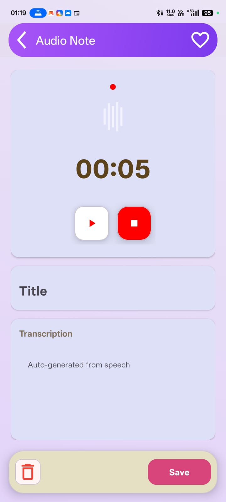
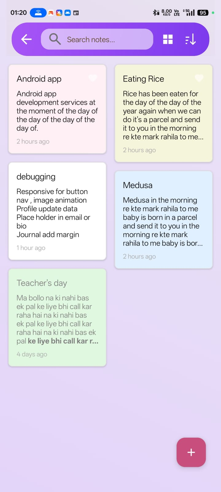
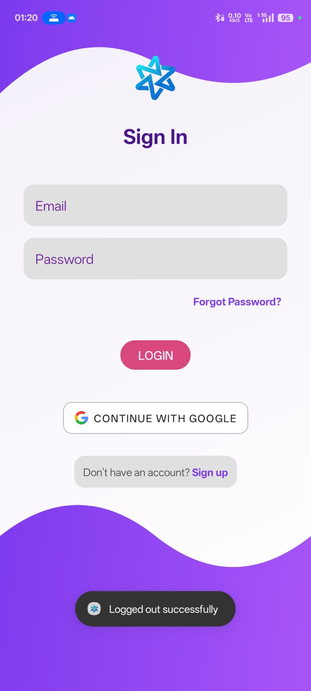

# NEXUS - All-in-One Productivity Suite 📱

**NEXUS** is a comprehensive Android productivity application that combines note-taking, e-book library, AI chatbot, journaling, and much more in one seamless experience.

---

## 🎥 Demo Video

*Click the button above to watch the complete feature demonstration*

---

## 📸 App Screenshots

### Main Features

  
  
  
  

### Notes & Organization

  
  
  
  

### E-Book Library & Layouts

  
  
  
  

### Additional Features

  
  
  
  

### Authentication

  

---

## ✨ Features

### 📝 Notes & Organization
- **Smart Notes** - Create text notes with rich formatting options
- **Voice to Text** - Audio transcription for quick note-taking
- **Background Customization** - Personalize notes with custom backgrounds
- **Text Styling** - Multiple color options and text formatting
- **Favorites** - Quick access to important notes from home screen
- **Universal Search** - Find any note instantly
- **Multiple Layouts** - Switch between linear and staggered grid views
- **Smart Sorting** - Organize notes by date, title, or custom order
- **Trash** - Safely delete and restore notes

### ✅ Task Management
- **To-Do Lists** - Create and manage tasks efficiently
- **Journal** - Daily journaling with rich text support

### 📚 E-Book Library
- **100+ Free Books** - Access a vast collection of e-books
- **Multiple Categories** - Browse books by genre
- **Free Downloads** - Direct download links for all books
- **Book Search** - Find books quickly with powerful search

### 🤖 AI Chatbot
- **Intelligent Assistant** - Get help with AI-powered conversations
- **Chat History** - Keep track of your interactions

### 🔐 Authentication & Security
- **Google Sign-In** - Quick authentication with Google
- **Email Authentication** - Traditional sign-in option
- **Password Reset** - Easy password recovery via email
- **Change Password** - Secure password management
- **Profile Management** - Customize your user profile

---

## 🛠️ Built With

- **Kotlin** - Primary programming language
- **Android Studio** - IDE
- **Firebase Authentication** - User authentication
- **Firebase Firestore** - Cloud database
- **Material Design 3** - UI/UX design
- **RecyclerView** - Efficient list rendering
- **Speech-to-Text API** - Voice transcription
- **AI Integration** - Chatbot functionality
- **MVVM Architecture** - Clean code structure

---

## 📋 Prerequisites

- Android Studio (latest version)
- Android SDK (minimum SDK 24)
- Firebase account
- Google Services JSON file

---

## 🚀 Getting Started

## 📱 APK Download

Download the latest version: [NEXUS v1.0.0](https://firebasestorage.googleapis.com/v0/b/journal-app-62caa.firebasestorage.app/o/video%2Fapp-debug.apk?alt=media&token=3b32941e-b989-4902-afcf-a87a7fa6d372)

---

## 🤝 Contributing

Contributions are welcome! Please feel free to submit a Pull Request.

1. Fork the project
2. Create your feature branch (`git checkout -b feature/AmazingFeature`)
3. Commit your changes (`git commit -m 'Add some AmazingFeature'`)
4. Push to the branch (`git push origin feature/AmazingFeature`)
5. Open a Pull Request

---

## 📄 License

This project is licensed under the MIT License - see the [LICENSE](LICENSE) file for details.

---

## 👨‍💻 Author

**Cool Developer Nigam**
- GitHub: [@Cool-Developer-Nigam](https://github.com/Cool-Developer-Nigam)
- Email: [nigam.nps@gmail.com](mailto:nigam.nps@gmail.com)

---

## 🙏 Acknowledgments

- Firebase for backend services
- Material Design for UI components
- Open source community

---

## 📞 Contact & Support

For support, email [nigam.nps@gmail.com](mailto:nigam.nps@gmail.com) or create an issue in this repository.

---

⭐ **If you found this project helpful, please give it a star!**

Made with ❤️ for productivity enthusiasts
